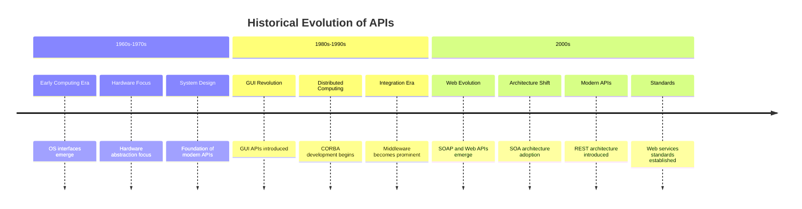

# API Design
## Part 1: Introduction

---

# What is an API?

<div style="display: flex; align-items: center;">
    <div style="flex: 1;">
        <!-- Content for the left column -->
        <ul>
            <li>Application Programming Interface</li>
            <li>Set of rules, protocols, and tools</li>
            <li>Enables communication between software applications</li>
            <li>Defines methods and data formats for information exchange</li>
        </ul>
    </div>
    <div style="flex: 1;">
        
    </div>
</div>

---

# Key Objectives of APIs

<div style="display: flex; align-items: flex-start;">
    <div style="flex: 1;">
        <ul>
            <li>Interoperability</li>
            <li>Modularity</li>
            <li>Efficiency</li>
            <li>Security</li>
            <li>Scalability</li>
        </ul>
    </div>
    <div style="flex: 1;">
        
    </div>
</div>

---

# Historical Evolution

<div class="mermaid-zoom">


</div>

---

# Modern Era (2010s-Present)

- REST dominance
- GraphQL introduction
- GRPC
- tRPC
- API federation and composition
- Enhanced security models
- Cloud-native patterns

---

# Types of APIs: Release Policies

<div style="display: flex; align-items: flex-start;">
    <div style="flex: 1;">
        <ul>
            <li><strong>Private APIs</strong>
                <ul>
                    <li>Internal use only</li>
                    <li>Controlled access</li>
                </ul>
            </li>
            <li><strong>Partner APIs</strong>
                <ul>
                    <li>Specific business partners</li>
                    <li>Limited external access</li>
                </ul>
            </li>
             <li><strong>Public APIs</strong>
                <ul>
                    <li>Open to all developers</li>
                    <li>Wide accessibility</li>
                </ul>
            </li>
        </ul>
    </div>
    <div style="flex: 1;">
        
    </div>
</div>

---

# Types of APIs: Web Architecture

<div style="display: flex; align-items: flex-start;">
    <div style="flex: 1;">
        <ul>
            <li><strong>SOAP</strong>
                <ul>
                    <li>XML-based messaging</li>
                    <li>Platform independent</li>
                    <li>Strict standards</li>
                </ul>
            </li>
            <li><strong>REST (Representational State Transfer)</strong>
                <ul>
                    <li>HTTP methods (GET, POST, PUT, DELETE)</li>
                    <li>Stateless communication</li>
                    <li>Resource-based URLs</li>
                </ul>
            </li>
        </ul>
    </div>
    <div style="flex: 1;">
        <ul>
            <li><strong>GraphQL</strong>
                <ul>
                    <li>Query language for APIs</li>
                    <li>Single endpoint</li>
                    <li>Client-specified data</li>
                </ul>
            </li>
            <li><strong>GRPC</strong>
                <ul>
                    <li>RPC-based API</li>
                    <li>High-performance</li>
                    <li>Language-agnostic</li>
                </ul>
            </li>
        </ul>
    </div>
</div>

---

# Other API Types

<div style="display: flex; align-items: flex-start; justify-content: space-between;">
    <div style="flex: 1; margin-right: 10px;">
        <ul>
            <li><strong>Operating System APIs</strong>
                <ul>
                    <li>Windows API</li>
                    <li>POSIX</li>
                    <li>Cocoa</li>
                </ul>
            </li>
            <li><strong>Database APIs</strong>
                <ul>
                    <li>JDBC</li>
                    <li>ODBC</li>
                </ul>
            </li>
            <li><strong>Hardware APIs</strong>
                <ul>
                    <li>Device drivers</li>
                    <li>System interfaces</li>
                </ul>
            </li>
        </ul>
    </div>
     <div style="text-align: right; width: 80%;">
      
   </div>

</div>
  
---

# API Design
## Part 2: API Design and Development

---

# Design Flow

## Overview
The design flow outlines the steps involved in the user registration process.

## Flow Diagram
- **Who**: User
- **What**: Register
- **Where**: `/api/register`
- **When**: On user action
- **Why**: To create a new user account
- **How**: 
    - **Method**: POST
    - **Response**: 200 OK


---

## API Design Framework
  
---

# API Security

---

## OWASP API Security Top 10

1. Broken Object Level Authorization
2. Broken Authentication
3. Excessive Data Exposure
4. Lack of Resources & Rate Limiting
5. Broken Function Level Authorization
6. Mass Assignment
7. Security Misconfiguration
8. Injection
9. Improper Assets Management
10. Insufficient Logging & Monitoring

---

## Implement API Security

- Configuration Encryption
- Data Validation
- Error Handling
- Authentication
- Access Log
- Data Protection
- Authorization
- SQL Injection
- Rate Limiting

---

## Configuration Encryption

### Example Configuration

```bash
DB_HOST=<host>
DB_PORT=<port>
DB_USER=<username>
DB_PASSWORD=<password>
METRIC_DB=<metric_database_name>
DB_NAME=<database_name>
```

### Encrypted Configuration

```bash
27YzrnlM3ovXwIP5o12wAGf9g3SLnProaOMLU1XLY7rZqoJjDyCreJqgesUhGh/ANlockqoxy2WYXpTQhKIdFArWjH62SXoXB6luywkKeQQXwuFp0Mz9F
```

### Command to Encrypt

```bash
go run ./pkg/encrypt/main.go <filepath> <hexkey 64 characters>
```

---

## Code Example
<div style="overflow-y: scroll; height: 400px; border: 1px solid #ccc; padding: 10px;">
```go
package security

import (
	"crypto/aes"
	"crypto/cipher"
	"crypto/rand"
	"encoding/base64"
	"encoding/hex"
	"fmt"
	"io"
)

func Encrypt(inputText string, hexKey string) (string, error) {
	// Decode hex key back to bytes
	key, err := hex.DecodeString(hexKey)
	if err != nil {
		return "", fmt.Errorf("error decoding key: %v", err)
	}

	block, err := aes.NewCipher(key)
	if err != nil {
		return "", fmt.Errorf("error creating cipher: %v", err)
	}

	nonce := make([]byte, 12)
	if _, err := io.ReadFull(rand.Reader, nonce); err != nil {
		return "", fmt.Errorf("error generating nonce: %v", err)
	}

	aesgcm, err := cipher.NewGCM(block)
	if err != nil {
		return "", fmt.Errorf("error creating GCM: %v", err)
	}

	ciphertext := aesgcm.Seal(nil, nonce, []byte(inputText), nil)
	encoded := base64.StdEncoding.EncodeToString(append(nonce, ciphertext...))
	return encoded, nil
}
```
</div>
---

## Apply Configuration Decryption

<div style="overflow-y: scroll; height: 400px; border: 1px solid #ccc; padding: 10px;">
```go
func NewConfig() *Config {
	once.Do(func() {
		relativePath := "../../config/encrypted.env"

		// Get the absolute path
		absolutePath, err := filepath.Abs(relativePath)
		if err != nil {
			fmt.Println(err)
			return
		}

		content, err := os.ReadFile(absolutePath)
		if err != nil {
			log.Fatalf("Error reading file: %v", err)
		}

		decryptedEnv, err := security.Decrypt(string(content), "2b2aac4013cff37435cb22ba6b0e338e2afbef15ac02abcf0a89de5d06d6ae10")
		if err != nil {
			fmt.Println(err)
			return
		}

		// Load the decrypted environment variables into Viper
		viper.SetConfigType("env")
		err = viper.ReadConfig(bytes.NewBufferString(decryptedEnv))
		if err != nil {
			fmt.Println("Failed to load env variables:", err)
			return
		}

		viper.AutomaticEnv()

		// Create a Config instance and set values from Viper
		instance = &Config{
			DBHost:          viper.GetString(DBHost),
			DBPort:          viper.GetInt(DBPort),
			DBUser:          viper.GetString(DBUser),
			DBPassword:      viper.GetString(DBPassword),
			DBName:          viper.GetString(DBName),
			SecretKey:       viper.GetString(SecretKey),
			TokenAge:        viper.GetInt(TokenAge),
			GraphQLPort:     viper.GetInt(GraphQLPort),
			LogServerPort:   viper.GetInt(LogServerPort),
			LogMergeMin:     viper.GetInt(LogMergeMin),
			LogMoveMin:      viper.GetFloat64(LogMoveMin),
			RateLimitReqSec: viper.GetInt(RateLimitReqSec),
			RateLimitBurst:  viper.GetInt(RateLimitBurst),
		}
	})
	return instance

```
</div>


---


# Part 3: Monitoring

<div style="display: flex; align-items: flex-start;">
    <div style="flex: 1;">
        <ul>
            OpenTelemetry is a set of tools, APIs, and SDKs that provides observability through distributed tracing, metrics, and logging.
            <li>tracing - What happens when a request is made to an application.</li>
            <li>metric - A measurement captured at runtime.</li>
            <li>logs - A log is a timestamped text record, either structured (recommended) or unstructured, with metadata.</li>
        </ul>
    </div>
    <div style="flex: 1;">
        
    </div>
</div>

---


<div style="display: flex; justify-content: space-between;">
    <div style="flex: 1; margin-right: 10px;">
        <h3>Health and Performance Tracking</h3>
        <ul>
            <li>Real-time performance metrics and dashboards</li>
            <li>Error rate and response time monitoring</li>
            <li>Resource utilization tracking</li>
            <li>SLA compliance monitoring and reporting</li>
        </ul>
    </div>
    <div style="flex: 1;">
        <h3>Analytics and Insights</h3>
        <ul>
            <li>Usage patterns and trends analysis</li>
            <li>Client behavior and adoption metrics</li>
            <li>Error pattern identification and tracking</li>
            <li>API call volume and traffic analysis</li>
        </ul>
    </div>
    <div style="flex: 1;">
        
    </div>
</div>


---

## Implement Monitoring
---

# Part 4: Maintenance

<div style="display: flex; align-items: flex-start;">
    <div style="flex: 1;">
        <ul>
            <li><strong>Lifecycle Management</strong>
                <ul>
                    <li>Regular security patches and updates</li>
                    <li>Version deprecation and sunset planning</li>
                    <li>Breaking changes communication strategy</li>
                    <li>Backward compatibility maintenance</li>
                </ul>
            </li>
            <li><strong>Support and Operations</strong>
                <ul>
                    <li>Issue tracking and resolution procedures</li>
                    <li>Documentation updates and maintenance</li>
                    <li>API endpoint health checks</li>
                    <li>Backup and disaster recovery planning</li>
                </ul>
            </li>
        </ul>
    </div>
    <div style="flex: 1;">
        
    </div>
</div>

---

# Part 5: Performance


<div style="display: flex; justify-content: space-between;">
    <div style="flex: 1; margin-right: 10px;">
        <h3>Optimization Techniques</h3>
        <ul>
            <li>Response caching implementation with appropriate TTL</li>
            <li>Pagination and result filtering to manage large datasets</li>
            <li>Compression of response payloads using GZIP</li>
            <li>Database query optimization and indexing strategies</li>
        </ul>
    </div>
    <div style="flex: 1;">
        <h3>Load Management</h3>
        <ul>
            <li>Request throttling and concurrent connection limits</li>
            <li>Load balancing across multiple server instances</li>
            <li>Asynchronous processing for heavy operations</li>
            <li>Connection pooling and resource optimization</li>
        </ul>
    </div>
    <div style="flex: 1;">
        <!-- Placeholder for any additional content or images -->
         
    </div>
</div>


---

# Part 6: Governance


<div style="display: flex; justify-content: space-between;">
    <div style="flex: 1; margin-right: 10px;">
        <h3>Standards and Policies</h3>
        <ul>
            <li>API versioning strategy and deprecation policies</li>
            <li>Documentation standards and maintenance procedures</li>
            <li>Naming conventions and URI structure guidelines</li>
            <li>Error handling and status code standardization</li>
        </ul>
         <h3>Compliance Management</h3>
        <ul>
            <li>Regular compliance audits and reporting</li>
            <li>Data privacy regulations adherence (GDPR, PDPA)</li>
            <li>Industry-specific compliance requirements</li>
            <li>API contract testing and validation</li>
        </ul>
    </div>
    <div style="flex: 1;">
        
    </div>
</div>


---

# Questions?

Thank you for your attention!

