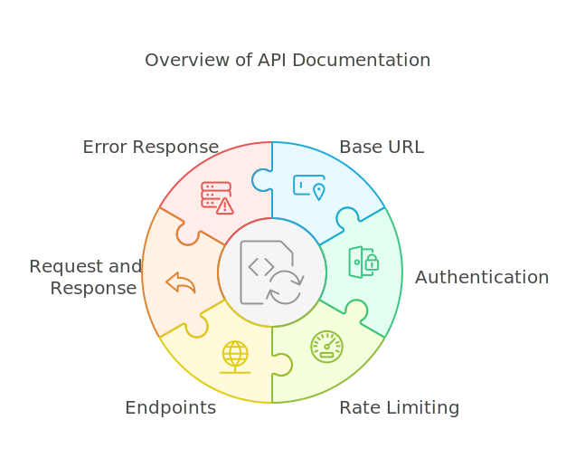
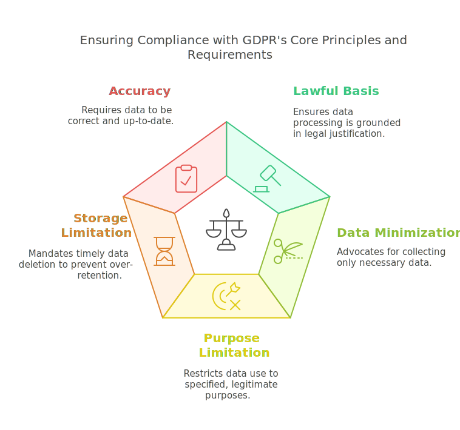

# API Design
## Part 1: Introduction

---

# What is an API?

<div style="display: flex; align-items: center;">
    <div style="flex: 1;">
        <!-- Content for the left column -->
        <ul>
            <li>Application Programming Interface</li>
            <li>Set of rules, protocols, and tools</li>
            <li>Enables communication between software applications</li>
            <li>Defines methods and data formats for information exchange</li>
        </ul>
    </div>
    <div style="flex: 1;">
        
    </div>
</div>

---

# Key Objectives of APIs

<div style="display: flex; align-items: flex-start;">
    <div style="flex: 1;">
        <ul>
            <li>Interoperability</li>
            <li>Modularity</li>
            <li>Efficiency</li>
            <li>Security</li>
            <li>Scalability</li>
        </ul>
    </div>
    <div style="flex: 1;">
        
    </div>
</div>

---

# Historical Evolution

<div class="mermaid-zoom">


</div>

---

# Modern Era (2010s-Present)

- REST dominance
- GraphQL introduction
- GRPC
- tRPC
- API federation and composition
- Enhanced security models
- Cloud-native patterns

---

# Types of APIs: Release Policies

<div style="display: flex; align-items: flex-start;">
    <div style="flex: 1;">
        <ul>
            <li><strong>Private APIs</strong>
                <ul>
                    <li>Internal use only</li>
                    <li>Controlled access</li>
                </ul>
            </li>
            <li><strong>Partner APIs</strong>
                <ul>
                    <li>Specific business partners</li>
                    <li>Limited external access</li>
                </ul>
            </li>
             <li><strong>Public APIs</strong>
                <ul>
                    <li>Open to all developers</li>
                    <li>Wide accessibility</li>
                </ul>
            </li>
        </ul>
    </div>
    <div style="flex: 1;">
        
    </div>
</div>

---

# Types of APIs: Web Architecture

<div style="display: flex; align-items: flex-start;">
    <div style="flex: 1;">
        <ul>
            <li><strong>SOAP</strong>
                <ul>
                    <li>XML-based messaging</li>
                    <li>Platform independent</li>
                    <li>Strict standards</li>
                </ul>
            </li>
            <li><strong>REST (Representational State Transfer)</strong>
                <ul>
                    <li>HTTP methods (GET, POST, PUT, DELETE)</li>
                    <li>Stateless communication</li>
                    <li>Resource-based URLs</li>
                </ul>
            </li>
        </ul>
    </div>
    <div style="flex: 1;">
        <ul>
            <li><strong>GraphQL</strong>
                <ul>
                    <li>Query language for APIs</li>
                    <li>Single endpoint</li>
                    <li>Client-specified data</li>
                </ul>
            </li>
            <li><strong>GRPC</strong>
                <ul>
                    <li>RPC-based API</li>
                    <li>High-performance</li>
                    <li>Language-agnostic</li>
                </ul>
            </li>
        </ul>
    </div>
</div>

---

# Other API Types

<div style="display: flex; align-items: flex-start; justify-content: space-between;">
    <div style="flex: 1; margin-right: 10px;">
        <ul>
            <li><strong>Operating System APIs</strong>
                <ul>
                    <li>Windows API</li>
                    <li>POSIX</li>
                    <li>Cocoa</li>
                </ul>
            </li>
            <li><strong>Database APIs</strong>
                <ul>
                    <li>JDBC</li>
                    <li>ODBC</li>
                </ul>
            </li>
            <li><strong>Hardware APIs</strong>
                <ul>
                    <li>Device drivers</li>
                    <li>System interfaces</li>
                </ul>
            </li>
        </ul>
    </div>
     <div style="text-align: right; width: 80%;">
      
   </div>

</div>
  
---

# API Design
## Part 2: API Design and Development

---

# Design Flow

## Overview
The design flow outlines the steps involved in the user registration process.

## Flow Diagram
- **Who**: User
- **What**: Register
- **Where**: `/api/register`
- **When**: On user action
- **Why**: To create a new user account
- **How**: 
    - **Method**: POST
    - **Response**: 200 OK


---

## API Design Framework
  
---

# API Security

---

## OWASP API Security Top 10

1. Broken Object Level Authorization
2. Broken Authentication
3. Excessive Data Exposure
4. Lack of Resources & Rate Limiting
5. Broken Function Level Authorization
6. Mass Assignment
7. Security Misconfiguration
8. Injection
9. Improper Assets Management
10. Insufficient Logging & Monitoring

<!--    
## Broken Object Level Authorization (BOLA)

Occurs when an API fails to validate that the requesting user has permission to access specific objects
Example: A user can access another user's data by simply changing the ID in the API request
Mitigation: Implement proper access controls and validate user permissions for each object access


##Broken Authentication

Failures in the implementation of authentication mechanisms
Common issues include weak password policies, improper session management, and insecure token handling
Mitigation: Implement strong authentication methods, secure session management, and proper token validation


## Excessive Data Exposure

APIs return more data than necessary, often relying on clients to filter sensitive information
Example: An API returns complete user objects including sensitive fields, expecting the client to hide them
Mitigation: Filter sensitive data on the server side, return only necessary information


## Lack of Resources & Rate Limiting

No restrictions on the size/number of resources requested by the client
Can lead to DoS attacks or resource exhaustion
Mitigation: Implement proper rate limiting, throttling, and resource quotas


## Broken Function Level Authorization

APIs don't properly verify if the authenticated user has the necessary privileges to perform certain actions
Example: A regular user can access admin functions by discovering the endpoint
Mitigation: Implement role-based access control (RBAC) and verify permissions for each function


## Mass Assignment

APIs automatically bind client-provided data to internal objects without proper filtering
Example: A user can modify their role to admin by adding a role parameter to the request
Mitigation: Explicitly define allowed properties and implement proper data filtering


## Security Misconfiguration

Improper security hardening of the API and its components
Issues include unsecured defaults, incomplete configurations, open cloud storage
Mitigation: Implement secure defaults, disable unnecessary features, use security headers


## Injection

Untrusted data is sent to an interpreter as part of a command or query
Common types include SQL, NoSQL, OS command injection
Mitigation: Use parameterized queries, input validation, and proper escaping


## Improper Assets Management

Lack of inventory of exposed API hosts and endpoints
Running outdated, unpatched systems or unnecessary features
Mitigation: Maintain API documentation, implement versioning, regular security reviews


## Insufficient Logging & Monitoring

Lack of proper logging of API activities and security events
No real-time monitoring or alerting for suspicious activities
Mitigation: Implement comprehensive logging, monitoring, and alerting systems
-->

---

## Implement API Security

- Configuration Encryption
- Data Validation
- Error Handling
- Authentication
- Authorization
- Access Log
- Data Protection
- SQL Injection
- Rate Limiting

---

## 2.1 Configuration Encryption

### Example Configuration

```bash
DB_HOST=<host>
DB_PORT=<port>
DB_USER=<username>
DB_PASSWORD=<password>
METRIC_DB=<metric_database_name>
DB_NAME=<database_name>
```

### Encrypted Configuration

```bash
27YzrnlM3ovXwIP5o12wAGf9g3SLnProaOMLU1XLY7rZqoJjDyCreJqgesUhGh/ANlockqoxy2WYXpTQhKIdFArWjH62SXoXB6luywkKeQQXwuFp0Mz9F
```

### Command to Encrypt

```bash
go run ./pkg/encrypt/main.go <filepath> <hexkey 64 characters>
```

---

## Code Example
<div style="overflow-y: scroll; height: 400px; border: 1px solid #ccc; padding: 10px;">

```go
package security

import (
	"crypto/aes"
	"crypto/cipher"
	"crypto/rand"
	"encoding/base64"
	"encoding/hex"
	"fmt"
	"io"
)

func Encrypt(inputText string, hexKey string) (string, error) {
	// Decode hex key back to bytes
	key, err := hex.DecodeString(hexKey)
	if err != nil {
		return "", fmt.Errorf("error decoding key: %v", err)
	}

	block, err := aes.NewCipher(key)
	if err != nil {
		return "", fmt.Errorf("error creating cipher: %v", err)
	}

	nonce := make([]byte, 12)
	if _, err := io.ReadFull(rand.Reader, nonce); err != nil {
		return "", fmt.Errorf("error generating nonce: %v", err)
	}

	aesgcm, err := cipher.NewGCM(block)
	if err != nil {
		return "", fmt.Errorf("error creating GCM: %v", err)
	}

	ciphertext := aesgcm.Seal(nil, nonce, []byte(inputText), nil)
	encoded := base64.StdEncoding.EncodeToString(append(nonce, ciphertext...))
	return encoded, nil
}
```
</div>
---

## Apply Configuration Decryption

<div style="overflow-y: scroll; height: 400px; border: 1px solid #ccc; padding: 10px;">

```go
func NewConfig() *Config {
	once.Do(func() {
		relativePath := "../../config/encrypted.env"

		// Get the absolute path
		absolutePath, err := filepath.Abs(relativePath)
		if err != nil {
			fmt.Println(err)
			return
		}

		content, err := os.ReadFile(absolutePath)
		if err != nil {
			log.Fatalf("Error reading file: %v", err)
		}

		decryptedEnv, err := security.Decrypt(string(content), "2b2aac4013cff37435cb22ba6b0e338e2afbef15ac02abcf0a89de5d06d6ae10")
		if err != nil {
			fmt.Println(err)
			return
		}

		// Load the decrypted environment variables into Viper
		viper.SetConfigType("env")
		err = viper.ReadConfig(bytes.NewBufferString(decryptedEnv))
		if err != nil {
			fmt.Println("Failed to load env variables:", err)
			return
		}

		viper.AutomaticEnv()

		// Create a Config instance and set values from Viper
		instance = &Config{
			DBHost:          viper.GetString(DBHost),
			DBPort:          viper.GetInt(DBPort),
			DBUser:          viper.GetString(DBUser),
			DBPassword:      viper.GetString(DBPassword),
			DBName:          viper.GetString(DBName),
			SecretKey:       viper.GetString(SecretKey),
			TokenAge:        viper.GetInt(TokenAge),
			GraphQLPort:     viper.GetInt(GraphQLPort),
			LogServerPort:   viper.GetInt(LogServerPort),
			LogMergeMin:     viper.GetInt(LogMergeMin),
			LogMoveMin:      viper.GetFloat64(LogMoveMin),
			RateLimitReqSec: viper.GetInt(RateLimitReqSec),
			RateLimitBurst:  viper.GetInt(RateLimitBurst),
		}
	})
	return instance

```
</div>


---

## 2.2 Data Validation

- Validate Data Type
```go
var user User
err := json.NewDecoder(r.Body).Decode(&user)
if err != nil {
	http.Error(w, err.Error(), http.StatusBadRequest)
	return
}
```

- Validate Data Length
```go
// Validate required fields
	if user.Username == "" || user.Password == "" {
		http.Error(w, "Username and password are required", http.StatusBadRequest)
		return
	}
```

- Validate Data Range
```go
if user.Age < 18 || user.Age > 100 {
	http.Error(w, "Age must be between 18 and 100", http.StatusBadRequest)
	return
}
```

---

## Data Validation (2)

- Validate Data Format
```go
if !regexp.MustCompile(`^[a-zA-Z0-9]+$`).MatchString(user.Password) {
	http.Error(w, "Password must contain only letters and numbers", http.StatusBadRequest)
	return
}
```
- Validate Data Constraint
```go
exists, err := userRepo.ExistsUserByName(user.Username)
	if err != nil {
		http.Error(w, err.Error(), http.StatusConflict)
		return
	}

	if exists {
		http.Error(w, "Username already exists", http.StatusConflict)
		return
	}
```

---

## 2.3 Error Handling

1. HTTP Status Code Best Practices
 


---

## Success Status (2xx)

- **200**: OK - Standard success response
- **201**: Created - Resource successfully created
- **204**: No Content - Successful operation, no content returned

---

## Client Error Status (4xx)

- **400**: Bad Request - Invalid parameters/format
- **401**: Unauthorized - Authentication failed
- **403**: Forbidden - Insufficient permissions
- **404**: Not Found - Resource doesn't exist
- **429**: Too Many Requests - Rate limit exceeded

---

## Server Error Status (5xx)

- **500**: Internal Server Error - Unexpected server errors
- **502**: Bad Gateway - Invalid response from upstream server
- **503**: Service Unavailable - Server temporarily down
- **504**: Gateway Timeout - Server timeout

---

# Error Response Structure

## Basic Template:

```json
{
    "status": 400,
    "status_text": "Bad Request",
    "error": {
        "code": "ERROR_CODE",
        "message": "User-friendly message",
        "details": {
            "field": "specific_field",
            "reason": "detailed explanation"
        },
        "request_id": "unique_request_identifier",
        "timestamp": "2024-01-06T12:00:00Z"
    }
}
```

---

# Error Handling Best Practices

## Consistency:

- Use consistent error formats across all endpoints
- Maintain uniform error codes and messages
- Follow predictable status code usage

## Security:

- Never expose sensitive information in errors
- Use generic messages for security-related errors
- Log detailed errors server-side only

---

## Documentation:

- Document all possible error codes
- Provide clear error messages
- Include remediation steps when applicable

---

## 2.4 Authentication

### Authentication Method

<div style="display: flex; justify-content: space-between;">
    <div style="flex: 1; margin-right: 10px;">
        <ul>
            <li><strong>Basic Authentication</strong></li>
            <li><strong>OAuth 2.0</strong></li>
            <li><strong>JWT</strong></li>
            <li><strong>API Key</strong></li>
        </ul>
    </div>
    <div style="flex: 1;">
        <h3>Authentication Flow</h3>
       
    </div>
</div>

---

### Authentication Example

<div style="overflow-y: scroll; height: 400px; border: 1px solid #ccc; padding: 10px;">

```go
func LoginHandler(w http.ResponseWriter, r *http.Request) {

	cors(w, r)
	var user User
	err := json.NewDecoder(r.Body).Decode(&user)
	if err != nil {
		resp := handler.NewErrorResponse(
			http.StatusBadRequest,
			"Bad Request",
			"INVALID_REQUEST",
			err.Error(),
			r.Header.Get("X-Request-ID"),
		)
		w.Header().Set("Content-Type", "application/json")
		json.NewEncoder(w).Encode(resp)
		return
	}

	userRepo := NewUserRepo()
	config := config.NewConfig()

	userdb, ok := userRepo.GetUserByName(user.Username) // users[user.Username]
	if ok != nil {
		resp := handler.NewErrorResponse(
			http.StatusUnauthorized,
			"Unauthorized",
			"INVALID_USERNAME",
			"Invalid username",
			r.Header.Get("X-Request-ID"),
		)
		w.Header().Set("Content-Type", "application/json")
		json.NewEncoder(w).Encode(resp)
		return
	}
	// fmt.Println("User")
	hash := HashString(user.Username + user.Password + userdb.Salt)
	// fmt.Println("UserDbPassword:", userdb.Password, "Hash:",hash, "UserNameDb:", userdb.Username, "username", user.Username )
	if userdb.Password != hash {
		resp := handler.NewErrorResponse(
			http.StatusUnauthorized,
			"Unauthorized",
			"INVALID_CREDENTIALS",
			"Invalid username or password",
			r.Header.Get("X-Request-ID"),
		)
		w.Header().Set("Content-Type", "application/json")
		json.NewEncoder(w).Encode(resp)
		return
	}

	// fmt.Println("Duration", time.Duration(config.TokenAge))
	expirationTime := time.Now().Add(time.Duration(config.TokenAge) * time.Minute)

	claims := &JwtClaims{
		UserId:   userdb.UserId,
		Username: userdb.Username,
		StandardClaims: jwt.StandardClaims{
			ExpiresAt: expirationTime.Unix(),
		},
	}

	token := jwt.NewWithClaims(jwt.SigningMethodHS256, claims)
	tokenString, err := token.SignedString([]byte(config.SecretKey))
	if err != nil {
		resp := handler.NewErrorResponse(
			http.StatusInternalServerError,
			"Internal Server Error",
			"TOKEN_GENERATION_FAILED",
			err.Error(),
			r.Header.Get("X-Request-ID"),
		)
		w.Header().Set("Content-Type", "application/json")
		json.NewEncoder(w).Encode(resp)
		return
	}

	http.SetCookie(w, &http.Cookie{
		Name:    "token",
		Value:   tokenString,
		Expires: expirationTime,
	})

	// Updated response format
	responseData := JwtToken{
		Token:     tokenString,
		ExpiredAt: expirationTime.Unix(),
	}
	resp := handler.NewResponse(http.StatusOK, "Success", responseData, r.Header.Get("X-Request-ID"))
	w.Header().Set("Content-Type", "application/json")
	json.NewEncoder(w).Encode(resp)
}

```
</div>


---

### JWT Middleware

<div style="overflow-y: scroll; height: 400px; border: 1px solid #ccc; padding: 10px;">

```go
func JWTMiddleware(excludedRoutes []string) func(http.Handler) http.Handler {
	return func(next http.Handler) http.Handler {
		return http.HandlerFunc(func(w http.ResponseWriter, r *http.Request) {
			// Check if the request path is in the excluded routes
			for _, route := range excludedRoutes {
				if strings.HasPrefix(r.URL.Path, route) {
					next.ServeHTTP(w, r) // Skip JWT validation
					return
				}
			}

			// Validate the JWT token
			tokenString := getTokenFromRequest(r)
			if tokenString == "" {
				http.Error(w, "Unauthorized", http.StatusUnauthorized)
				return
			}

			token, err := validateToken(tokenString)
			if err != nil || !token.Valid {
				http.Error(w, "Unauthorized", http.StatusUnauthorized)
				return
			}

			// If valid, pass the request to the next handler
			next.ServeHTTP(w, r)
		})
	}
}
```
</div>

---

## 2.5 Authorization


---

## 2.6 Access Logs


```json
{
  "log_id": 1,
  "user_id": "user123",
  "resource_name": "Login",
  "action": "login",
  "timestamp": "2023-10-01T12:00:00Z",
  "ip_address": "192.168.1.1",
  "user_agent": "Mozilla/5.0 (Windows NT 10.0; Win64; x64)",
  "status_code": 200,
  "response": "Login successful"
}
```

---

## 2.7 Data Protection

| Type | Original | Masked |
|---------------------|-------------------------|-----------------------|
| ID Card Number | 1234-5678-9012 | ****-****-9012 |
| Credit Card Number | 1234 5678 9012 3456 | **** **** **** 3456 |
| Mobile Number | +1-234-567-8901 | +1-***-***-8901 |

- SQL Masking
```sql
create function mask_phone(phone varchar(20)) returns varchar(20)
begin
    return replace(phone, substring(phone, 4, 4), '****');
end;
```
- Backend Masking
```go
func mask_phone(phone string) string {
    return strings.Replace(phone, phone[4:8], "****", 1)
}
```

---

## 2.8 SQL Injection

### SQL Injection Example

```http
GET http://host/api/products?textsearch=shoe;DELETE FROM users WHERE id = 1;
```

### SQL Injection Prevention

- Execute single statements
```go
db.Query(sql)
```
- Database permissions protect delete and drop objects
```sql
GRANT DELETE, DROP ON users TO user;
``` 
- Execute permissions protect execute stored procedures
```sql
GRANT EXECUTE ON PROCEDURE sp_delete_user TO user;
```


---

## 2.9 Rate Limiting

<div style="display: flex; justify-content: space-between;">
    <div style="flex: 1; margin-right: 10px;">
        <ul>
            <li><strong>Security Benefits</strong></li>
            <li>DDoS Protection</li>
            <li>Mitigates automated attacks</li>
            <li>Blocks brute force attempts</li>
            <li>Prevents credential stuffing</li>
            <li>Limits impact of bot traffic</li>
            <li><strong>API Abuse Prevention</strong></li>
            <li>Stops data scraping</li>
            <li>Prevents unauthorized bulk operations</li>
            <li>Protects sensitive endpoints</li>
            <li>Identifies suspicious patterns</li>
        </ul>
    </div>
    <div style="flex: 1;">
       
    </div>
</div>

---

### Rate Limit Middleware

```go
func RateLimitMiddleware(limit rate.Limit, burst int) func(http.Handler) http.Handler {
	limiter := rate.NewLimiter(limit, burst)

	return func(next http.Handler) http.Handler {
		return http.HandlerFunc(func(w http.ResponseWriter, r *http.Request) {
			if !limiter.Allow() {
				http.Error(w, "Rate limit exceeded", http.StatusTooManyRequests)
				return
			}
			next.ServeHTTP(w, r)
		})
	}
}
```
---

### Token Bucket Algorithm


---

# Part 3: Monitoring

<div style="display: flex; align-items: flex-start;">
    <div style="flex: 1;">
        <ul>
            OpenTelemetry is a set of tools, APIs, and SDKs that provides observability through distributed tracing, metrics, and logging.
            <li>tracing - What happens when a request is made to an application.</li>
            <li>metric - A measurement captured at runtime.</li>
            <li>logs - A log is a timestamped text record, either structured (recommended) or unstructured, with metadata.</li>
        </ul>
    </div>
    <div style="flex: 1;">
        
    </div>
</div>

---


<div style="display: flex; justify-content: space-between;">
    <div style="flex: 1; margin-right: 10px;">
        <h3>Health and Performance Tracking</h3>
        <ul>
            <li>Real-time performance metrics and dashboards</li>
            <li>Error rate and response time monitoring</li>
            <li>Resource utilization tracking</li>
            <li>SLA compliance monitoring and reporting</li>
        </ul>
    </div>
    <div style="flex: 1;">
        <h3>Analytics and Insights</h3>
        <ul>
            <li>Usage patterns and trends analysis</li>
            <li>Client behavior and adoption metrics</li>
            <li>Error pattern identification and tracking</li>
            <li>API call volume and traffic analysis</li>
        </ul>
    </div>
    <div style="flex: 1;">
        
    </div>
</div>

---

  
## Log Practice


---
layout: two-cols
---

## API Log Middleware Practice


#### LogResponseWriter
- Custom wrapper around `http.ResponseWriter`
- Captures status code and response length
- Allows tracking of response metrics

### APILogMiddleware
- Basic logging middleware that captures:
  - Request ID
  - Log Level
  - User ID
  - Request method and path
  - Client IP address
  - Response status code
  - Request duration
  - Response size
  - User agent
  - Request Payload

::right::

<br/>
<br/>

### WithRequestID
- Adds request tracking capability
- Generates or propagates request IDs
- Useful for tracing requests across services

### Configurable Logger (APILogConfig)
- Allows customization of logging behavior
- Can log headers, cookies, and body
- Supports redaction of sensitive information
- Configurable through options

---

### Implement Log

<div style="overflow-y: scroll; height: 400px; border: 1px solid #ccc; padding: 10px;">

```go
func ApiLogMiddleware(next http.Handler) http.Handler {
	return http.HandlerFunc(func(w http.ResponseWriter, r *http.Request) {
		recorder := &ResponseRecorder{
			ResponseWriter: w,
			Body:           &bytes.Buffer{},
		}

		start := time.Now()
		body, err := io.ReadAll(r.Body)

		r.Body = io.NopCloser(bytes.NewBuffer(body))

		w.Header().Set("Content-Type", "application/json")
		if err != nil {
			if err = json.Unmarshal(body, &body); err != nil {

				w.WriteHeader(http.StatusBadRequest)

				errResp := handler.NewErrorResponse(
					http.StatusBadRequest,
					"Bad Request",
					"INVALID_REQUEST",
					"Invalid request body",
					GetRequestID(r),
				)

				json.NewEncoder(w).Encode(errResp)
				return
			}
		}

		// Call the next handler
		next.ServeHTTP(recorder, r)
		writeApiLog(r, recorder, body, start)
	})
}

func writeApiLog(r *http.Request, w http.ResponseWriter, body []byte, start time.Time) {
	logEntry, err := prepareApiLog(r, w, body, start)
	if err != nil {
		log.Printf("Log Error:%v", err)
		return
	}

	fmt.Printf("Audit Log: %+v\n", logEntry)
	apiLog := logger.GetLogInitializer()

	// Start the log writing Go routine
	go apiLog.WriteApiLogToFile(*logEntry)
}

func prepareApiLog(r *http.Request, w http.ResponseWriter, body []byte, start time.Time) (*logger.ApiLog, error) {

	uaString := r.Header.Get("User-Agent")
	token := r.Header.Get("Authorization")
	ip := r.RemoteAddr

	// Parse the User-Agent
	ua := user_agent.New(uaString)
	// Get the browser name and version
	browserName, browserVersion := ua.Browser()
	// Get the operating system name
	osInfo := ua.OS()
	device := ua.Model()
	userId := getUserIdFromJWT(token)
	status := getStatusCode(w)
	level := getLogLevel(status.Status)

	requestData := getRequestData(r, body)
	requestData = maskSensitiveData(requestData)
	errorMsg := getErrorFromResponse(w)

	logData := &logger.ApiLog{
		Level:                level,
		RequestID:            GetRequestID(r),
		Timestamp:            time.Now(),
		Duration:             time.Since(start),
		Method:               r.Method,
		Path:                 r.URL.Path,
		StatusCode:           status.Status,
		StatusText:           status.StatusText,
		RequestBody:          requestData,
		ClientIP:             ip,
		ClientBrowser:        browserName,
		ClientBrowserVersion: browserVersion,
		ClientOS:             osInfo,
		ClientOSVersion:      ua.OSInfo().Version,
		ClientDevice:         device,
		UserID:               userId,
		Error:                errorMsg,
	}
	return logData, nil
}

// internal/logger/logger.go
func (li *Logger) WriteApiLogToFile(logEntry ApiLog) {
	// Ensure initialization happens only once
	li.Initialize()
	conf := config.GetConfig()

	// Determine the log file name based on the current timestamp (every 5 minutes)
	// time := logEntry.Timestamp.Format("2025-01-12-18_39")
	logFileName := fmt.Sprintf("%04d-%02d-%02d-%02d_%02d.log",
		logEntry.Timestamp.Year(),
		logEntry.Timestamp.Month(),
		logEntry.Timestamp.Day(),
		logEntry.Timestamp.Hour(),
		(logEntry.Timestamp.Minute()/conf.LogMergeMin)*conf.LogMergeMin,
	)
	// logFileName := GetPeriodFileName(logEntry.Timestamp, conf.LogMergeMin)

	fmt.Printf("logFileName: %v, conf.LogMergeMin: %v\n", logFileName, conf.LogMergeMin)

	// relativePath := "../../logs"
	logFilePath := filepath.Join(relativePath, logFileName)
	absolutePath, err := filepath.Abs(logFilePath)
	if err != nil {
		log.Printf("Error obtaining absolute path: %v", err)
		return
	}

	// Use a mutex to ensure thread safety
	li.logMutex.Lock()
	defer li.logMutex.Unlock()

	// If the current file path changes, close the previous file and open a new one
	if li.currentPath != absolutePath {
		if li.currentFile != nil {
			li.currentFile.Close()
		}

		li.currentPath = absolutePath

		// Open the new file
		li.currentFile, err = os.OpenFile(absolutePath, os.O_APPEND|os.O_CREATE|os.O_WRONLY, 0644)
		if err != nil {
			log.Printf("Error opening log file: %v", err)
		}
	}

	// Write the log entry as JSON to the file
	jsonData, err := json.Marshal(logEntry)
	if err != nil {
		log.Printf("Error marshaling log data: %v", err)
		return
	}

	_, err = li.currentFile.Write(append(jsonData, '\n')) // Add newline
	if err != nil {
		log.Printf("Error writing to log file: %v", err)
		return
	}
}
``` 
</div>
---

## Trace Middleware Practice

- OpenTelemetry

<div style="overflow-y: scroll; height: 200px; border: 1px solid #ccc; padding: 10px;">

```go
// cmd/server/main.go

func main() {
	shutdown, err := monitoring.InitTracer(viper.GetString("TRACE_EXPORTER_URL"))
    }

// internal/monitoring/otel.go
package monitoring

import (
	"log"
	"context"
	"os"

	"go.opentelemetry.io/otel"
	"go.opentelemetry.io/otel/exporters/zipkin"
	"go.opentelemetry.io/otel/sdk/resource"
	sdktrace "go.opentelemetry.io/otel/sdk/trace"
	semconv "go.opentelemetry.io/otel/semconv/v1.24.0"
)


var logger = log.New(os.Stderr, "api", log.Ldate|log.Ltime|log.Llongfile)

// initTracer creates a new trace provider instance and registers it as global trace provider.
func InitTracer(url string) (func(context.Context) error, error) {
	// Create Zipkin Exporter and install it as a global tracer.
	//
	// For demoing purposes, always sample. In a production application, you should
	// configure the sampler to a trace.ParentBased(trace.TraceIDRatioBased) set at the desired
	// ratio.
	exporter, err := zipkin.New(
		url,
		zipkin.WithLogger(logger),
	)
	if err != nil {
		return nil, err
	}

	batcher := sdktrace.NewBatchSpanProcessor(exporter)

	tp := sdktrace.NewTracerProvider(
		sdktrace.WithSpanProcessor(batcher),
		sdktrace.WithResource(resource.NewWithAttributes(
			semconv.SchemaURL,
			semconv.ServiceName("api"),
		)),
	)
	otel.SetTracerProvider(tp)

	return tp.Shutdown, nil
}

```
</div>

<div style="overflow-y: scroll; height: 400px; border: 1px solid #ccc; padding: 10px;">

```go
// internal/middleware/tracing.go
package middleware

import (
	"net/http"

	"go.opentelemetry.io/otel"
	"go.opentelemetry.io/otel/attribute"
	"go.opentelemetry.io/otel/propagation"
	"go.opentelemetry.io/otel/trace"
)

// TracingMiddleware adds OpenTelemetry tracing to requests
func TracingMiddleware(next http.Handler) http.Handler {
	tracer := otel.Tracer("api-server")
	propagator := otel.GetTextMapPropagator()

	return http.HandlerFunc(func(w http.ResponseWriter, r *http.Request) {
		ctx := propagator.Extract(r.Context(), propagation.HeaderCarrier(r.Header))

		ctx, span := tracer.Start(ctx, r.URL.Path,
			trace.WithAttributes(
				attribute.String("http.method", r.Method),
				attribute.String("http.url", r.URL.String()),
			),
		)
		defer span.End()

		// Update request with traced context
		r = r.WithContext(ctx)
		next.ServeHTTP(w, r)
	})
}

```
</div>

---

## Metric Middleware Practice

### Time Series Database
- Grafana
- Prometheus
- Thanos
- TimescaleDB
---

# Part 4: Maintenance

<div style="display: flex; align-items: flex-start;">
    <div style="flex: 1;">
        <ul>
            <li><strong>Lifecycle Management</strong>
                <ul>
                    <li>Regular security patches and updates</li>
                    <li>Version deprecation and sunset planning</li>
                    <li>Breaking changes communication strategy</li>
                    <li>Backward compatibility maintenance</li>
                </ul>
            </li>
            <li><strong>Support and Operations</strong>
                <ul>
                    <li>Issue tracking and resolution procedures</li>
                    <li>Documentation updates and maintenance</li>
                    <li>API endpoint health checks</li>
                    <li>Backup and disaster recovery planning</li>
                </ul>
            </li>
        </ul>
    </div>
    <div style="flex: 1;">
        
    </div>
</div>

---

## Versioning

- Compatibility
- Deprecation
- Breaking Changes

 
 

---

### Log Retention
 

---

# Part 5: Performance


<div style="display: flex; justify-content: space-between;">
    <div style="flex: 1; margin-right: 10px;">
        <h3>Optimization Techniques</h3>
        <ul>
            <li>Response caching implementation with appropriate TTL</li>
            <li>Pagination and result filtering to manage large datasets</li>
            <li>Compression of response payloads using GZIP</li>
            <li>Database query optimization and indexing strategies</li>
        </ul>
    </div>
    <div style="flex: 1;">
        <h3>Load Management</h3>
        <ul>
            <li>Request throttling and concurrent connection limits</li>
            <li>Load balancing across multiple server instances</li>
            <li>Asynchronous processing for heavy operations</li>
            <li>Connection pooling and resource optimization</li>
        </ul>
    </div>
    <div style="flex: 1;">
        <!-- Placeholder for any additional content or images -->
         
    </div>
</div>

---

## Pagination

 

---

### Response Compression
 
---

## Caching

- One Instance
 

---

## Caching (2)
- Multiple Instance
 
---

## Load Management

 


---

## Circuit Breaker

 
---

# Part 6: Governance

<div style="display: flex; justify-content: space-between;">
    <div style="flex: 1; margin-right: 10px;">
        <h3>Standards and Policies</h3>
        <ul>
            <li>API versioning strategy and deprecation policies</li>
            <li>Documentation standards and maintenance procedures</li>
            <li>Naming conventions and URI structure guidelines</li>
            <li>Error handling and status code standardization</li>
        </ul>
         <h3>Compliance Management</h3>
        <ul>
            <li>Regular compliance audits and reporting</li>
            <li>Data privacy regulations adherence (GDPR, PDPA)</li>
            <li>Industry-specific compliance requirements</li>
            <li>API contract testing and validation</li>
        </ul>
    </div>
    <div style="flex: 1;">
        
    </div>
</div>

---

## API Documentation



<div style="text-align: right;">
    <br/>
    <a href="./api-docs.html">API Docs</a>
</div>

---

## API Specification


---

## API key validation


<div style="text-align: right;">
    <br/>
    <a href="./api-keys.html">API Keys</a>
</div>
---

## Data privacy regulation
### GDPR


---

### HIPAA


---

## Implementation Guidelines


<div style="text-align: right;">
    <br/>
    <a href="./privacy-regulations.html">Data Privacy Regulations</a>
</div>

---

## API Design Full Features


---

### Workshop Challenge

- Data Validation on Middleware support multiple rules and clean code
- Design More Secure Token Authentication not available cross origin
- Implement Transform Middleware to transform request and response for masking sensitive data
- Implement Pagination Cursor Types
- Implement Caching Middleware
- Implement Rate Limiting Middleware by Tenant
- Design Data Privacy Regulation Middleware
- Design Consent verification Middleware
- Design Audit logging Middleware
- Generate API Documentation and API Specification
- Discuss about API Design Management Framework
- Discuss about API Design Governance Framework

---

# Questions?

Thank you for your attention!
